<div align="center">

# 🏢⚡ Seattle Building Energy Prediction

### Pipeline ML déployable pour anticiper la consommation énergétique des bâtiments non-résidentiels

[](https://www.python.org/)
[](https://scikit-learn.org/)
[](https://www.bentoml.com/)
[](https://docs.pydantic.dev/)
[](https://www.docker.com/)
[](https://aws.amazon.com/apprunner/)
[](LICENSE)

**[Contexte](#-contexte-business)** • **[Stack](#%EF%B8%8F-stack-technique)** • **[Architecture](#%EF%B8%8F-architecture)** • **[Démarrage](#-démarrage-rapide)** • **[Résultats](#-résultats)** • **[API](#-lapi-en-pratique)**

</div>

---

## 📋 Contexte business

**Ville de Seattle, objectif neutralité carbone 2050.** Les bâtiments non destinés à l'habitation sont une source majeure de consommation énergétique et d'émissions de CO2. Le **Seattle Building Performance Standards (BPS)** impose un reporting énergétique réglementaire, et les agents de la ville ont effectué en 2016 des relevés minutieux — coûteux à obtenir.

L'enjeu : **prédire la consommation énergétique** des bâtiments n'ayant pas encore fait l'objet de relevés, à partir de leurs seules caractéristiques structurelles (taille, usage, date de construction, localisation). Cette prédiction doit alimenter une **API d'aide à la décision** permettant aux services municipaux et aux propriétaires de bâtiments de prioriser les rénovations énergétiques et d'identifier les bâtiments énergivores.

> 🎯 **Mission** : déployer un modèle ML supervisé prédisant le **SiteEUIWN** (*Site Energy Use Intensity Weather Normalized*, en kBtu/sf) à partir des caractéristiques structurelles d'un bâtiment, exposé via une API REST conteneurisée et déployable sur le cloud.

---

## 🎯 Objectifs

- ✅ Réaliser une analyse exploratoire des données de benchmark énergétique 2016 (~3 000 bâtiments, ~60 variables)
- ✅ Concevoir un **feature engineering métier** (âge, ratio parking, densité d'étages, distance au centre-ville)
- ✅ Comparer **4 algorithmes** de régression supervisée et identifier le meilleur compromis performance / interprétabilité
- ✅ Optimiser le modèle retenu via **GridSearchCV + validation croisée 5-fold**
- ✅ Exposer le modèle via une **API REST** validée (BentoML + Pydantic)
- ✅ Conteneuriser et préparer le déploiement Cloud (AWS App Runner)

---

## 🏗️ Architecture

```mermaid
flowchart LR
    A[📁 Seattle Benchmark 2016<br/>~3000 bâtiments, ~60 variables] --> B[🧹 Nettoyage<br/>Doublons, NA, outliers]
    B --> C[🔧 Feature Engineering<br/>building_age, parking_ratio,<br/>floor_density, distance_downtown]
    C --> D[⚙️ Pipeline sklearn<br/>OneHot + Normalisation]
    D --> E[🏋️ Entraînement & Comparaison<br/>LR / RF / GB / XGBoost]
    E --> F[🔍 GridSearchCV<br/>5-fold cross-validation]
    F --> G[🏆 Modèle final<br/>Gradient Boosting optimisé]
    G --> H[📦 BentoML<br/>Model + custom_objects]
    H --> I[🚀 service.py<br/>API REST + Pydantic]
    I --> J[🐳 Docker image]
    J --> K[☁️ AWS App Runner<br/>déploiement de test]
```



Le pipeline est conçu pour être **reproductible de bout en bout** : les notebooks documentent chaque étape, les datasets intermédiaires (`df_clean.csv`, `df_features.csv`) sont versionnés pour permettre à un évaluateur de tester directement la modélisation ou l'API sans rejouer l'EDA complète.

---

## 🛠️ Stack technique

| Composant | Technologie | Version | Rôle |
|-----------|-------------|---------|------|
| **Langage** | Python | 3.11+ | Pipeline complet |
| **Data manipulation** | pandas, numpy | — | EDA, feature engineering |
| **Visualisation** | matplotlib, seaborn | — | Exploration et reporting |
| **ML** | scikit-learn | `1.7.2` | Pipeline, modèles, GridSearchCV |
| **ML (alternative)** | XGBoost | — | Modèle comparatif |
| **Model serving** | BentoML | — | Packaging + API REST |
| **Validation** | Pydantic V2 | — | Schéma d'entrée API strict |
| **Conteneurisation** | Docker | — | Image générée via `bentoml containerize` |
| **Cloud** | AWS App Runner | — | Déploiement de test (arrêté après validation) |

---

## 📊 Dataset

**Source** : [Seattle Building Energy Benchmarking 2016](https://data.seattle.gov/dataset/2016-Building-Energy-Benchmarking/2bpz-gwpy)

| Caractéristique | Valeur |
|-----------------|--------|
| Volume initial | ~3 000 bâtiments |
| Nombre de variables | ~60 (structure, usage, surface, localisation) |
| **Target retenue** | `SiteEUIWN` (kBtu/sf) — Site Energy Use Intensity Weather Normalized |
| Périmètre | Bâtiments **non destinés à l'habitation** uniquement |
| Année | 2016 |
| Filtre outliers | Suppression `SiteEUIWN < 2` (incohérences manifestes) |

**Choix de la cible** : `SiteEUIWN` (et non `TotalGHGEmissions`) car c'est la métrique standard de la ville de Seattle pour comparer la performance énergétique entre bâtiments, indépendamment de leur taille (`/sf`) et des conditions climatiques annuelles (*weather normalized*).

---

## 🚀 Démarrage rapide

### Prérequis

- Python 3.11+
- Docker (pour le déploiement)
- Compte AWS configuré (optionnel, pour le déploiement Cloud)

### Installation

```bash
# Cloner le repo
git clone https://github.com/Melkia44/Building-energy-consumption-ml.git
cd Building-energy-consumption-ml

# Créer un environnement virtuel
python -m venv .venv
source .venv/bin/activate  # Linux/Mac
# .venv\Scripts\activate   # Windows

# Installer les dépendances
pip install -r requirements.txt
```

### Reproduire la modélisation

```bash
# Exécuter les notebooks dans l'ordre
jupyter notebook MLO-Notebook-Etude.ipynb        # 1. Analyse exploratoire
jupyter notebook MLO-Notebook-Feature.ipynb      # 2. Feature engineering
jupyter notebook MLO-Notebook-Models.ipynb       # 3. Modélisation + GridSearchCV
```

### Lancer l'API BentoML en local

```bash
# Sauvegarder le modèle dans le store BentoML (depuis le notebook Models)
# Puis lancer le service
bentoml serve service:SeattleEnergyGBService --reload

# L'API est accessible sur http://localhost:3000
# Documentation Swagger : http://localhost:3000/docs
```

### Conteneuriser et déployer

```bash
# Build de l'image Docker
bentoml build
bentoml containerize seattle_energy_gb_service:latest

# Push vers ECR puis déploiement sur AWS App Runner
# (voir documentation AWS App Runner pour les étapes détaillées)
```

---

## 📁 Structure du projet

```
Building-energy-consumption-ml/
├── MLO-Notebook-Etude.ipynb         # Analyse exploratoire (EDA)
├── MLO-Notebook-Feature.ipynb       # Feature engineering
├── MLO-Notebook-Models.ipynb        # Modélisation, GridSearchCV, interprétation
├── Data/                            # Données sources Seattle Benchmark 2016
├── df_clean.csv                     # Dataset après nettoyage
├── df_features.csv                  # Dataset avec features dérivées
├── service.py                       # API BentoML (logique d'inférence + Pydantic)
├── bentofile.yaml                   # Configuration BentoML pour le build
├── .gitignore
└── README.md
```

---

## 🧠 Choix de conception

### 1. Modèle retenu : Gradient Boosting (vs XGBoost)

XGBoost a obtenu des résultats légèrement meilleurs en absolu, mais **Gradient Boosting (sklearn) a été retenu** pour trois raisons :

- ✅ **Stabilité supérieure** par rapport à Random Forest (qui montrait du surapprentissage)
- ✅ **Lisibilité du code** et alignement naturel avec le pipeline `sklearn` existant
- ✅ **Simplicité opérationnelle** pour un premier déploiement en production

*"On peut toujours upgrader vers XGBoost en V2 si les performances sont insuffisantes en production."*

### 2. Feature engineering métier

Au-delà des variables brutes, **4 features dérivées** ont été créées pour capter le fonctionnement réel des bâtiments :

| Feature | Formule | Intuition métier |
|---------|---------|------------------|
| `building_age` | `2025 - YearBuilt` | Les bâtiments anciens sont moins isolés |
| `parking_ratio` | `PropertyGFAParking / PropertyGFATotal` | Surface parking = consommation différente |
| `floor_density` | `NumberOfFloors / PropertyGFATotal` | Compacité verticale du bâtiment |
| `distance_to_downtown_km` | Distance Haversine vers Downtown Seattle (47.6062, -122.3321) | Effet urbain / périurbain |

### 3. Anti-data leakage strict

**Toutes les variables dérivées de la consommation réelle ont été exclues** des features d'entraînement :
- Pas de `Electricity(kWh)`, `NaturalGas(therms)`, `SteamUse(kBtu)`
- Pas de `SiteEnergyUse(kBtu)` ni dérivés
- Justification : ces grandeurs ne sont **disponibles qu'après mesure**, donc inutilisables pour prédire une consommation non encore mesurée.

### 4. Validation Pydantic stricte côté API

```python
class BuildingInput(BaseModel):
    model_config = ConfigDict(extra="forbid")     # rejette tout champ inconnu
    year_built: int = Field(..., ge=1800, le=CURRENT_YEAR)
    latitude: float = Field(..., ge=-90, le=90)
    property_gfa_total: float = Field(..., gt=0)
    # ... 14 champs avec bornes métier
```

L'API refuse les inputs aberrants **avant** d'atteindre le modèle (année > 2025, latitude > 90°, surface négative, etc.).

### 5. Persistance de `feature_names` via `custom_objects`

```python
self.feature_names = self.model_ref.custom_objects.get("feature_names")
```

L'ordre canonique des features est sauvegardé avec le modèle. Cela **prévient le drift d'ordre des colonnes** entre entraînement et inférence — un piège classique en production ML.

### 6. Tag de modèle verrouillé

```python
MODEL_TAG = "seattle_energy_gb:b5ptlkg7dgbmwaam"   # version pinnée
```

Au lieu de `seattle_energy_gb:latest`, le service utilise une **version spécifique** identifiée par son hash. Évite les régressions silencieuses en cas de réentrainement.

---

## 📈 Résultats

### Performances du modèle final (Gradient Boosting optimisé)

| Métrique | Valeur |
|----------|--------|
| **MAE** | ≈ 30–35 kBtu/sf |
| **RMSE** | ≈ 50–60 kBtu/sf (optimisé à **≈ 51**) |
| **R²** | ≈ 0.45–0.50 |

**Hyperparamètres optimaux** (issus de GridSearchCV 5-fold) :

```python
{
    "n_estimators": 200,
    "learning_rate": 0.1,
    "max_depth": 4
}
```

**Lecture honnête** : Un R² de ≈0.50 peut paraître modeste, mais reste cohérent avec la **forte hétérogénéité structurelle et fonctionnelle** des bâtiments du dataset (un Data Center et un Restaurant sont très différents en consommation). La validation croisée confirme la **stabilité du modèle** (pas de surapprentissage significatif).

### Top features les plus importantes

D'après l'analyse de feature importance du modèle optimisé :

1. **Usage du bâtiment** (Data Center, Supermarket/Grocery, Restaurant, Laboratory) → facteur dominant
2. **Surface totale** (`PropertyGFATotal`)
3. **Âge du bâtiment** (`building_age`)
4. **Ratio parking** (`parking_ratio`)
5. **Distance au centre-ville** (`distance_to_downtown_km`)

> 💡 **Insight métier** : La consommation énergétique est principalement expliquée par **l'usage du bâtiment**, **sa taille**, et certaines caractéristiques structurelles — plus que par la seule localisation.

---

## 🔮 L'API en pratique

### Exemple de requête (curl)

```bash
curl -X POST http://localhost:3000/predict \
  -H "Content-Type: application/json" \
  -d '{
    "year_built": 1985,
    "building_type": "Commercial",
    "primary_property_type": "Office",
    "neighborhood": "Downtown",
    "zip_code": 98101,
    "ListOfAllPropertyUseTypes": "Office, Parking",
    "largest_property_use_type": "Office",
    "latitude": 47.6062,
    "longitude": -122.3321,
    "property_gfa_total": 50000,
    "property_gfa_parking": 5000,
    "number_of_floors": 10,
    "number_of_buildings": 1,
    "usage_count": 2
  }'
```

### Réponse JSON

```json
{
  "prediction": 67.42,
  "unit": "kBtu/sf (SiteEUIWN)",
  "message": "Prédiction de consommation énergétique annuelle",
  "model_tag": "seattle_energy_gb:b5ptlkg7dgbmwaam",
  "inputs_interpreted": {
    "year_built": 1985,
    "building_age": 40.0,
    "parking_ratio": 0.1,
    "floor_density": 0.0002,
    "distance_to_downtown_km": 0.0,
    "...": "..."
  }
}
```

L'API renvoie **la prédiction + les features dérivées calculées** côté serveur, ce qui rend chaque appel traçable et debuggable.

---

## 🌱 Aller plus loin (V2)

Améliorations identifiées pour une version industrielle :

- 📅 **Ajouter des indicateurs climatiques annuels** (température moyenne, degrés-jours de chauffage / refroidissement)
- 🏭 **Modèles spécialisés par type d'usage** (un modèle pour Data Centers, un autre pour Restaurants, etc.)
- 📈 **Intégrer plusieurs années de benchmark** (2017, 2018, 2019…) pour capter la dynamique temporelle
- 🌍 **Étendre au modèle d'émissions CO2** (`TotalGHGEmissions`) en parallèle du modèle énergie
- 🧪 **Tests unitaires automatisés** sur le service.py (`pytest` + `bentoml.testing`)
- 📊 **Monitoring de drift** (Evidently, WhyLogs) une fois en production

---

## 📂 Documents complémentaires

- 📄 [`Support_de_présentation.pdf`](./Support_de_presentation.pdf) — Présentation soutenance (méthodologie, choix techniques, résultats)

---

## 👤 Auteur

**Mathieu Lowagie**  
Data Engineer | Service Delivery Manager — 17 ans d'expérience B2B télécoms

🔗 [LinkedIn](https://www.linkedin.com/in/mathieulowagie/) • 💼 [GitHub](https://github.com/Melkia44)

---

## 📄 Licence

Projet réalisé dans le cadre du **Master 2 Data Engineering** (OpenClassrooms — Projet 6 *"Anticipez les besoins en consommation de bâtiments"*).

Distribué sous licence **MIT** — voir [LICENSE](LICENSE) pour les détails.
